<p align="center"></p>

# build-your-users-mind

> **What you mind is what you get.**

**🌐 [EN](README.md) · [DE](locales/de/README.md) · [ES](locales/es/README.md) · [JA](locales/ja/README.md) · [RU](locales/ru/README.md) · [ZH](locales/zh/README.md)** — English is authoritative; translations may lag.

A local-first recipe for an operator to build an empirical, inspectable **preference and
decision-support model** from their own AI interaction logs. It can help an authorized agent
anticipate feedback in recurring situations; it does not reveal a person's mind and must not be
used for psychological diagnosis, covert profiling, or high-stakes autonomous decisions.

It works by **feedforward**: the agent makes an explicitly uncertain feedback prediction, uses it
only inside the operator's authorization boundary, and later evaluates it against real feedback.
Novel, external, irreversible, or high-impact actions always require confirmation.

**Status:** `1.1.0-dev` — public development release. The deterministic safety and classification
contracts are tested on Windows and Linux; semantic model quality still requires human review.

## "I know what you want."

The agent reads authorized logs, distils **what the user explicitly decided, how they phrased it,
and whether later feedback offered a weak outcome signal**, and turns it into a small set of living,
editable documents. These are hypotheses with citations, not facts about an inner mental state.

It is **not** a chatbot persona and **not** a heavy framework — it is a method + a handful of scripts
+ document templates. The only agent-specific part is the *source adapter* (where each agent reads its
own logs). Everything else is universal.

## Try it in 60 seconds

Run the deterministic preparation/validation pipeline and feedback scorer **offline** on synthetic
data — no LLM, no API key, no network:

```bash
git clone https://github.com/ellmos-ai/build-your-users-mind
cd build-your-users-mind
python examples/synthetic-demo/run_demo.py
```

You'll watch `extract → merge → chunk → classify → validate → aggregate → score feedback` run on a
fictional user's logs and pre-authored loop fixtures (a planted secret gets redacted), then the hard
validation gate reject a tampered result with a non-zero exit. The fixtures demonstrate mechanics,
not accuracy. Details: [`examples/synthetic-demo/`](examples/synthetic-demo/).

[](https://youtu.be/oJlrCHW-BXQ)

🎬 **Watch the 2:28 demo:** https://youtu.be/oJlrCHW-BXQ

## Built with OpenAI Codex

- The **Codex source adapter** (`scripts/adapters/codex_adapter.py`) — the component that reads
  Codex's own session logs — **was written by Codex itself** in Codex Session
  `019ed298-fdc4-72d2-a255-97d7dc117128` (commit `1e3abc4`, *"Add Codex source adapter (delegated
  to Codex, control-tested)"*), then control-tested on 946 real prompts. This earlier contribution
  is intentionally attributed to Codex without claiming a specific model version.
- **Codex also authored this repository's discovery metadata** — commit `0ec49df` carries the git
  author `Codex <codex@local>`. It's all in the git history.
- **GPT-5.6 powered the final Build Week hardening pass through Codex** (Codex Session
  `019f8674-fe9a-7d91-a80f-7ee799e8ced0`). It found and fixed nine privacy and data-integrity
  defects across source extraction, redaction, corpus merging, and prediction scoring; the final
  deterministic suite contains 73 tests.
- Codex is a first-class **source**: what Codex learns about the user flows into the same shared,
  evidence-cited model that all agents consume (see `SOURCE-ADAPTERS.md`).

## Start here

| If you are... | Open first | Why |
|---|---|---|
| An AI agent adding user-memory discipline | `SKILL.md` | End-to-end implementation recipe |
| A maintainer wiring log sources | `SOURCE-ADAPTERS.md` | Claude, Codex, Gemini/agy and Kimi log locations |
| A reviewer checking safety boundaries | `SECURITY.md` and `.gitignore` | Redaction, private-corpus and generated-avatar exclusions |
| A researcher comparing concepts | `TAXONOMY.md` | Prompt-Archaeology categories and decision patterns |

## Find this repository

Canonical search phrase: **`ellmos-ai/build-your-users-mind`**.

Useful discovery phrases:
- `AI agent theory of mind user model`
- `LLM user modeling from interaction logs`
- `Codex Claude Gemini Kimi source adapters`
- `prompt archaeology feedback precognition`
- `local-first AI personalization templates`
- `agent memory decision support from prompt logs`

Disambiguation: this is not a SaaS personalization product, HR platform, chatbot persona pack,
general prompt library or psychological diagnosis tool. It is a local-first documentation and script
kit for building an evidence-backed user model from private agent interaction logs.

## How it works — feedback precognition

A 0→4 runtime loop (see `templates/START.md`):

| Step | File | Role |
|---|---|---|
| 0 | project `DECISIONS.md` | project-specific decisions win (more specific) |
| 1 | `WHAT-<USER>-SAID` | **evidence-based** rules/decisions (with prompt-ID citations) |
| 2 | `WHAT-WOULD-<USER>-SAY` | **precognition** — predicted feedback + confidence (🟢/🟡/🔴) |
| 3 | `WHAT-I-DID…` + `MY-ACTIONS.txt` | log of actions taken on the prediction |
| 4 | `WHAT-<USER>-SAID-ABOUT…` | **evaluation** — prediction vs. reality → improves (1) and (2) |

Quality metric = **how often the anticipated reaction matches the user's real later feedback.**
At 🔴 (novel/no pattern) the rule is **escalate, don't guess.**
Measure it from the loop files with
[`scripts/score_predictions.py`](scripts/score_predictions.py): hit rate overall and per
🟢/🟡/🔴 tier, plus the 🔴 escalation rate.

### Pipeline (build the model)
1. **Extract** (`scripts/corpus_extract.py`) — deterministic: pull only human-typed prompts from your
   logs, filter synthetic turns, **redact secrets**, link each prompt to the next turn's `outcome_signal`
   (praise/correction/reissue/none).
2. **Merge** (`scripts/merge_corpora.py`) — combine source-specific outputs without overwriting or
   renumbering stable evidence IDs.
3. **Chunk** (`scripts/chunk_corpus.py`) — dedupe, optional domains, and build a fresh manifest bound
   to the exact corpus SHA-256.
4. **Classify** — use `templates/CLASSIFY-CHUNK.md` and `schemas/classification.schema.json`, then run
   `scripts/validate_classifications.py`. Missing rows, malformed output, stale files, and ID
   collisions are hard failures.
5. **Aggregate** (`scripts/aggregate_stats.py`) — type distribution, B:K ratio, turning points.
6. **Author** the avatar files from `templates/` and **bind** a short pointer into the agent's own
   memory/rules file (Claude `CLAUDE.md`, Codex `GPT.md`/`AGENTS.md`, Gemini `GEMINI.md`, …).

See `SKILL.md` for the full recipe and `SOURCE-ADAPTERS.md` for per-agent log locations.

## Theory of us — theoretical background

The system models the **dyad** (agent ↔ user), not just the user in isolation — a *theory of us*.
It is grounded in:
- **Theory of Mind** research for LLM agents — predicting and conditioning on an interlocutor's mental
  state improves outcomes (e.g. *ToM-SWE*, arXiv 2510.21903; *Infusing Theory of Mind into Socially
  Intelligent LLM Agents*, 2509.22887; *Persistent Memory & User Profiles*, 2510.07925).
- **Prompt-Archaeology** (L. Geiger) — the method of classifying full human-AI interaction protocols,
  whose 8-type taxonomy this module reuses (`TAXONOMY.md`).
- A known limit: LLM ToM is **robust on recurring cases, fragile under novel/adversarial variation** —
  hence the confidence tiers and the "escalate, don't guess" rule.

## Bias & limits (read before trusting it)
- **Silent approval is invisible** — users type corrections, not praise → the model over-represents
  corrections and skews "critical". Calibrate accordingly.
- **Evidence IDs are deterministic, but evidence claims and labels are synthesized** — resolve
  load-bearing IDs against the raw corpus and review the inference.
- **Classifier bias** — spot-check a sample; report inter-rater agreement for serious use.

## Privacy & redaction
Use only logs the operator is authorized to process. Extractors fail closed on missing roots,
invalid dates, unreadable/empty inputs, and missing timestamps; an empty replacement requires
explicit `--allow-empty`, while accepting malformed partial input requires `--allow-partial`.
Writes are atomic and private where the platform supports permissions.
Built-in rules cover common current tokens (including modern project-scoped API tokens), credentials, asymmetric credential material,
emails, IP-like values, and long digit runs. Domain-specific health, legal, tax, financial, or other
sensitive content cannot be inferred reliably: provide reviewed `--redaction-rules` before writing
or sharing. Never commit a real corpus or filled avatar file — see `.gitignore`.

## Suggested GitHub topics
`theory-of-mind` · `llm` · `user-modeling` · `personalization` · `ai-agents` · `prompt-analysis`
· `feedback` · `decision-support`

## Credits & License
Method: *Prompt-Archaeology* by Lukas Geiger. Module & concept: Lukas Geiger (+ Claude).
Bundled dependency: `swarm-operations` skill. **MIT** — see `LICENSE`.
Reference implementation (private, not shipped): a personal instance built on the author's own logs.
