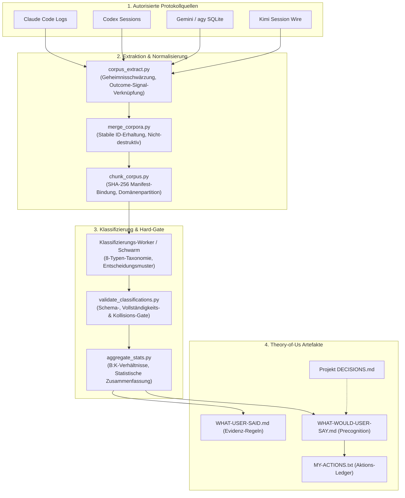
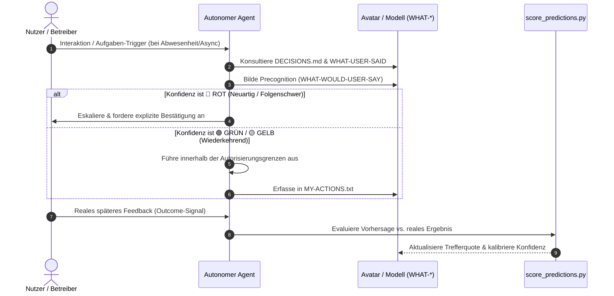

<p align="center"></p>

# build-your-users-mind

<p align="center">
  <a href="https://github.com/ellmos-ai/build-your-users-mind/actions"></a>
  <a href="https://github.com/ellmos-ai/build-your-users-mind/releases"></a>
  <a href="https://www.python.org"></a>
  <a href="https://github.com/ellmos-ai"></a>
  <a href="https://github.com/open-bricks"></a>
  <a href="llms.txt"></a>
  <a href="LICENSE"></a>
</p>

> **What you mind is what you get.**

**🌐 [EN](README.md) · [DE](README_de.md) · [ES](locales/es/README.md) · [JA](locales/ja/README.md) · [RU](locales/ru/README.md) · [ZH](locales/zh/README.md)** — Englisch ist maßgeblich.

Ein lokales Rezept für Betreiber, um aus ihren eigenen KI-Interaktionsprotokollen ein empirisches, überprüfbares **Präferenz- und Entscheidungsunterstützungsmodell** aufzubauen. Es hilft autorisierten Agenten, Feedback in wiederkehrenden Situationen zu antizipieren; es offenbart nicht die innere Psyche einer Person und darf nicht für psychologische Diagnostik, verdecktes Profiling oder autonome Entscheidungen mit hohem Risiko eingesetzt werden.

Es funktioniert per **Feedforward**: Der Agent trifft eine explizit mit Unsicherheit behaftete Feedback-Vorhersage, nutzt diese ausschließlich innerhalb der Autorisierungsgrenzen des Betreibers und evaluiert sie später anhand des tatsächlichen Feedbacks. Neuartige, externe, irreversible oder folgenreiche Handlungen erfordern stets eine explizite Bestätigung.

**Status:** `1.1.0-dev` — Öffentliches Entwicklungs-Release. Die deterministischen Sicherheits- und Klassifizierungsverträge sind auf Windows und Linux getestet; die semantische Modellqualität erfordert menschliche Überprüfung.

## Systemarchitektur & Pipeline



## Feedback-Precognition Laufzeit-Schleife



## „Ich weiß, was du willst.“

Der Agent liest autorisierte Protokolle, destilliert, **was der Nutzer explizit entschieden hat, wie er es formuliert hat und ob späteres Feedback ein schwaches Ergebnissignal lieferte**, und wandelt dies in eine kleine Reihe lebendiger, editierbarer Dokumente um. Dies sind zitierte Hypothesen, keine Fakten über einen inneren mentalen Zustand.

Es ist **keine** Chatbot-Persona und **kein** schwerfälliges Framework – es ist eine Methode + eine Handvoll Skripte + Dokumentvorlagen. Der einzige agentspezifische Teil ist der *Source Adapter* (wo jeder Agent seine eigenen Protokolle liest). Alles andere ist universell.

## In 60 Sekunden ausprobieren

Führen Sie die deterministische Vorbereitungs-/Validierungspipeline und den Feedback-Scorer **offline** auf synthetischen Daten aus – ohne LLM, ohne API-Key, ohne Netzwerk:

```bash
git clone https://github.com/ellmos-ai/build-your-users-mind
cd build-your-users-mind
python examples/synthetic-demo/run_demo.py
```

Sie sehen, wie `extract → merge → chunk → classify → validate → aggregate → score feedback` auf synthetischen Nutzerprotokollen und vordefinierten Schleifen-Fixtures läuft (ein platziertes Geheimnis wird geschwärzt), woraufhin das strenge Validierungs-Gate ein manipuliertes Ergebnis mit einem Exit-Code ungleich Null abweist. Details: [`examples/synthetic-demo/`](examples/synthetic-demo/).

[](https://youtu.be/oJlrCHW-BXQ)

🎬 **2:28-Demo ansehen:** https://youtu.be/oJlrCHW-BXQ

## Erstellt mit OpenAI Codex

- Der **Codex Source Adapter** (`scripts/adapters/codex_adapter.py`) – die Komponente, die Codex' eigene Sitzungsprotokolle liest – **wurde von Codex selbst geschrieben** in Codex Session `019ed298-fdc4-72d2-a255-97d7dc117128` (Commit `1e3abc4`), danach an 946 echten Prompts kontrollgetestet.
- **Codex hat auch die Discovery-Metadaten dieses Repositories verfasst** – Commit `0ec49df` trägt den Git-Autor `Codex <codex@local>`.
- **GPT-5.6 trieb den finalen Build-Week-Härtungslauf über Codex an** (Codex Session `019f8674-fe9a-7d91-a80f-7ee799e8ced0`). Dabei wurden neun Datenschutz- und Datenintegritätsmängel behoben; die finale Testsuite umfasst 82 bestandene Tests.
- Codex ist eine erstklassige **Quelle**: Was Codex über den Nutzer lernt, fließt in dasselbe evidenzzitierte Modell ein (siehe `SOURCE-ADAPTERS.md`).

## Einstieg

| Zielgruppe | Erste Datei | Zweck |
|---|---|---|
| KI-Agenten mit Nutzerspeicher-Disziplin | `SKILL.md` | Vollständiges Implementierungsrezept |
| Maintainer von Protokollquellen | `SOURCE-ADAPTERS.md` | Speicherorte für Claude, Codex, Gemini/agy und Kimi |
| Reviewer für Sicherheitsgrenzen | `SECURITY.md` und `.gitignore` | Schwärzung, Ausschluss privater Corpora und Avatare |
| Forscher für Konzeptvergleiche | `TAXONOMY.md` | Prompt-Archäologie-Kategorien und Entscheidungsmuster |

## Geschwisterwerkzeuge & Ökosystem

`build-your-users-mind` ist Teil des **[ellmos-ai](https://github.com/ellmos-ai)** Ökosystems unter dem Dach von **[open-bricks](https://github.com/open-bricks)**:

| Werkzeug | Fokus | Rolle im Ökosystem |
|---|---|---|
| [coma](https://github.com/ellmos-ai/coma) | Kontext-Management | Lokales Speicher-Rückgrat und Konversations-Zustandsverwaltung |
| [swarm-ai](https://github.com/ellmos-ai/swarm-ai) | Multi-Agenten-Schwärme | Hierarchische Worker-Verteilung und Konsens-Klassifizierung |
| [memoryhooker](https://github.com/ellmos-ai/memoryhooker) | Speicher-Trigger | Hook-basierte Persistenz und reaktiver Kontext-Abruf |
| [workflowhooker](https://github.com/ellmos-ai/workflowhooker) | Workflow-Hooks | Lebenszyklus-Ereignisse und Ausführungssicherheit für Agenten |
| [system-explorer](https://github.com/ellmos-ai/system-explorer) | Discovery-Engine | Flotten-Inspektion und Stack-Kompositionswerkzeuge |
| [policy-registry](https://github.com/ellmos-ai/policy-registry) | Policy-Verträge | Deklarative Sicherheitsrichtlinien und Validierungsregeln |
| [sqlite-transit-sync](https://github.com/ellmos-ai/sqlite-transit-sync) | SQLite-Transit | Verschlüsselte SQLite-Replikation und Snapshot-Synchronisation |
| [ellmos-delegation-authority](https://github.com/ellmos-ai/ellmos-delegation-authority) | Delegation | Dynamisches Rollen-Routing und Aufgabenzuweisung |
| [prompt-archaeology-casestudy2](https://github.com/research-line/prompt-archaeology-casestudy2) | Prompt-Archäologie | Empirische Fallstudie zu langfristigen Interaktionsmustern |
| [DevCenter](https://github.com/dev-bricks/DevCenter) | Entwickler-Hub | Zentrales Entwicklerportal aller open-bricks Produkte |
| [CodeBox](https://github.com/dev-bricks/CodeBox) | Code-Utilities | Entwickler-Werkzeuge, Syntax-Parser und Packaging-Tools |

## Repository finden

Kanonischer Suchbegriff: **`ellmos-ai/build-your-users-mind`**.

Relevante Discovery-Begriffe:
- `AI agent theory of mind user model`
- `LLM user modeling from interaction logs`
- `Codex Claude Gemini Kimi source adapters`
- `prompt archaeology feedback precognition`
- `local-first AI personalization templates`
- `agent memory decision support from prompt logs`

## Wie es funktioniert — Feedback-Precognition

Ein 0→4 Laufzeit-Loop (siehe `templates/START.md`):

| Schritt | Datei | Rolle |
|---|---|---|
| 0 | Projekt `DECISIONS.md` | Projektspezifische Entscheidungen gewinnen (spezifischer) |
| 1 | `WHAT-<USER>-SAID` | **Evidenzbasierte** Regeln/Entscheidungen (mit Zitaten von Prompt-IDs) |
| 2 | `WHAT-WOULD-<USER>-SAY` | **Precognition** (Vorahnung) — vorhergesagtes Feedback + Konfidenz (🟢/🟡/🔴) |
| 3 | `WHAT-I-DID…` + `MY-ACTIONS.txt` | Protokoll der auf Basis der Vorhersage ergriffenen Maßnahmen |
| 4 | `WHAT-<USER>-SAID-ABOUT…` | **Evaluierung** — Vorhersage vs. Realität → verbessert (1) und (2) |

Qualitätsmetrik = **wie oft die erwartete Reaktion mit dem tatsächlichen späteren Feedback des Nutzers übereinstimmt.**
Bei 🔴 (neu/kein Muster) lautet die Regel: **Eskalieren, nicht raten.**
Messung aus den Schleifendateien mit [`scripts/score_predictions.py`](scripts/score_predictions.py).

### Pipeline (Modell erstellen)
1. **Extraktion** (`scripts/corpus_extract.py`) — deterministisch: Nur vom Menschen geschriebene Prompts aus den Protokollen ziehen, synthetische Runden filtern, **Geheimnisse schwärzen**, jeden Prompt mit dem `outcome_signal` der nächsten Runde verknüpfen.
2. **Zusammenführen** (`scripts/merge_corpora.py`) — quellenspezifische Ausgaben kombinieren, ohne stabile Evidenz-IDs zu überschreiben oder umzunummerieren.
3. **Chunking** (`scripts/chunk_corpus.py`) — Deduplizierung, optionale Domänen und Erstellung eines frischen Manifests, das an den exakten Korpus-SHA-256 gebunden ist.
4. **Klassifizieren** — Vorlage `templates/CLASSIFY-CHUNK.md` und `schemas/classification.schema.json` nutzen, danach `scripts/validate_classifications.py` ausführen. Fehlende Zeilen, fehlerhafte Ausgaben und Kollisionen führen zu hartem Abbruch.
5. **Aggregieren** (`scripts/aggregate_stats.py`) — Typverteilung, B:K-Verhältnis, Wendepunkte.
6. **Erstellen & Binden** der Avatar-Dateien aus `templates/` und Verknüpfung in die Speicherdatei des Agenten.

## Theory of Us — Theoretischer Hintergrund

Das System modelliert die **Dyade** (Agent ↔ Nutzer), nicht nur den Nutzer isoliert – eine *Theory of Us*.
Es basiert auf:
- Forschung zu **Theory of Mind** für LLM-Agenten (z. B. *ToM-SWE*, arXiv 2510.21903; *Infusing Theory of Mind into Socially Intelligent LLM Agents*, 2509.22887; *Persistent Memory & User Profiles*, 2510.07925).
- **Prompt-Archäologie** (L. Geiger) — die Methode zur Klassifizierung vollständiger Mensch-KI-Interaktionsprotokolle (`TAXONOMY.md`).
- Eine bekannte Grenze: LLM-ToM ist **robust bei wiederkehrenden Fällen, aber anfällig bei neuartigen/adversarialen Variationen** — daher die Konfidenzstufen und die Regel „Eskalieren, nicht raten“.

## Privatsphäre & Schwärzung
Verwenden Sie nur Protokolle, zu deren Verarbeitung der Betreiber autorisiert ist. Extraktoren schlagen bei fehlenden Wurzeln, ungültigen Datumsangaben, unlesbaren/leeren Eingaben und fehlenden Zeitstempeln fehl. Eingebaute Regeln decken gängige Token, Zugangsdaten, E-Mails, IP-Adressen und lange Ziffernfolgen ab. Domänenspezifische sensible Daten erfordern geprüfte `--redaction-rules`. Niemals echte Corpora committen — siehe `.gitignore`.

## Lizenz
Methode: *Prompt-Archaeology* von Lukas Geiger. Modul & Konzept: Lukas Geiger (+ Claude).
Gebündelte Abhängigkeit: `swarm-operations` Skill. **MIT** — siehe `LICENSE`.
